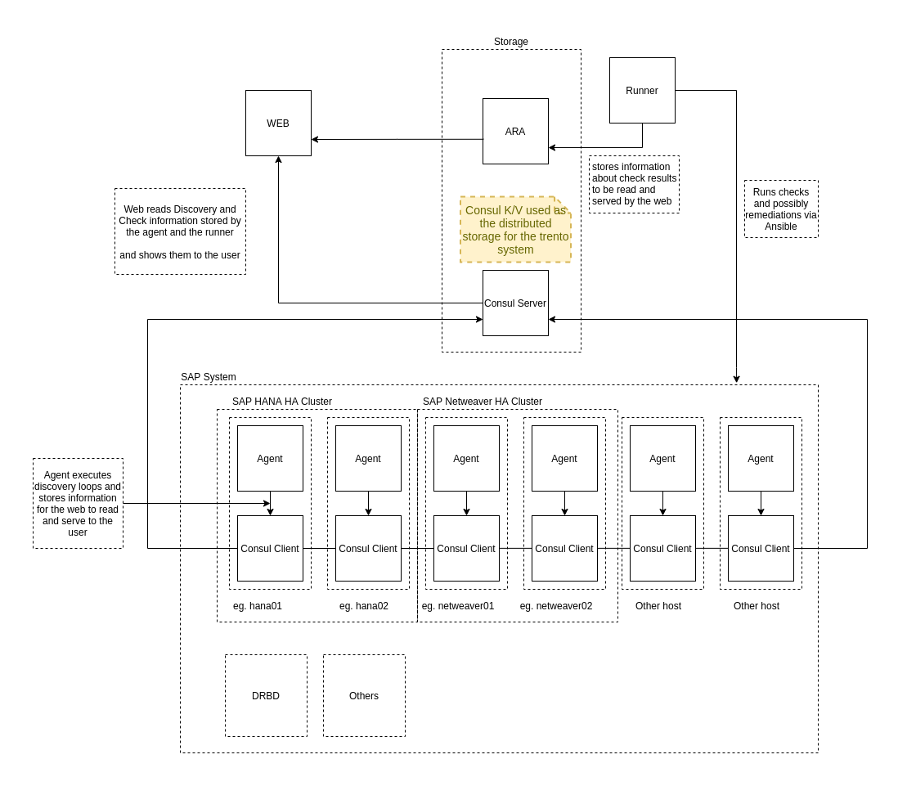

# Trento Example Deployment Layout

## Trento Agent

The Trento Agent is to be set up on every node that should be handled by Trento,
and it needs to be combined with a Consul Agent. 

The Trento Agent will run several periodic job loops. 

### Discovery Loop

The Discovery loop is happening at a very low frequency and priority and is capturing record-worthy
Data in the Consul Key-Value Store. At the current implementation, only selected datapoints are
regularly updated into the Consul Key-Value Store. There is no conflict-resolution being implemented,
the data is unconditionally overwritten.

## Checker Loop

TBD

# Nomenclature

Whenever the Trento user is exposed to concepts, the following naming should
be used consistently in the user visible dialogs, messages and templates. For
code internal usages the `SAP` prefix should be omitted.

## SAP Host

This is a physical or a virtual server ("node") running a Linux Operating System on which SAP system components are installed and running on (potentially supervised
by cluster management software like for example pacemaker).

## SAP System

This uses a very traditional multi-tier client server setup:

* Presentation Layer: Web Browser, Dedicated GUI or 3rd Party Application between End-User and Application Servers. Out of control for Trento.

* Application Server Layer: Business applications which the end users interact with (can be written in ABAP programming language, for example)

* Database Server Layer: Contains the customer data and all the ABAP code which is run by the application servers. Most often this is SAP HANA.